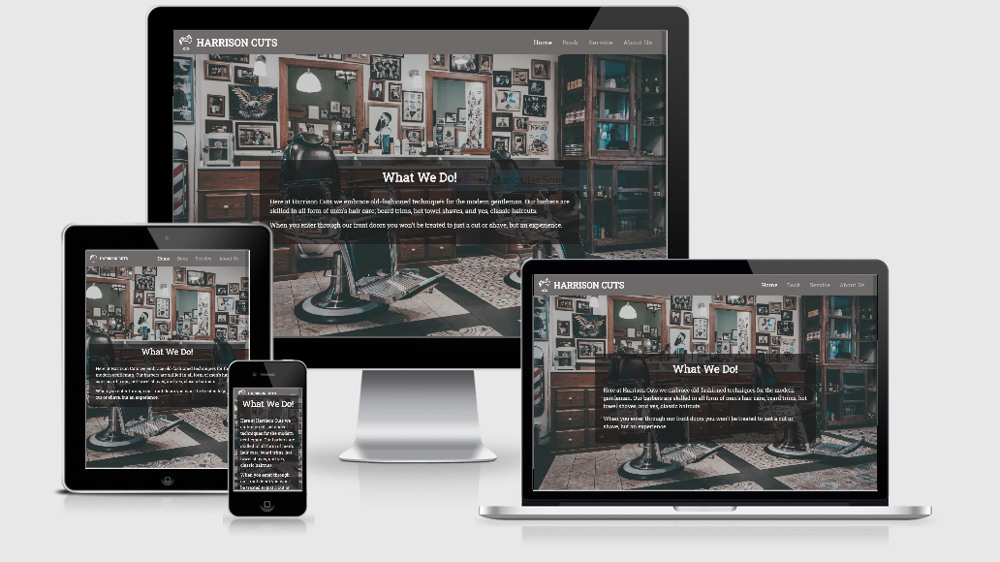
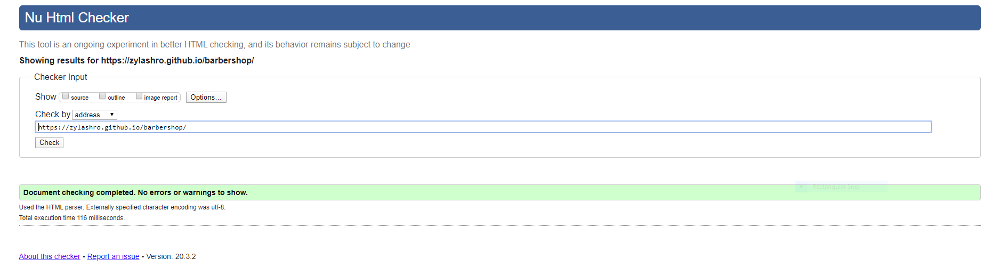
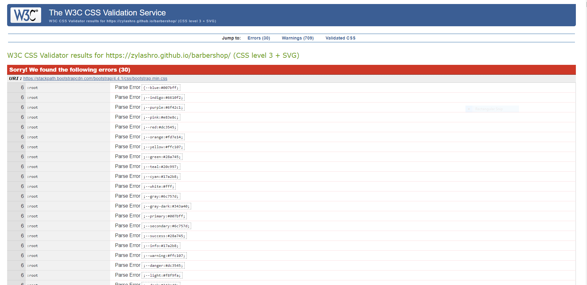

[Live Site](https://zylashro.github.io/barbershop/)

# Harrison Cuts

This project is designed as a service website for an imaginary barber   shop, *Harrison Cuts*, to showcase my ability to use HTML and CSS for my Milestone One Project for Code Institute. 

## Table of Contents

1. [**Project**](#project)
2. [**UX**](#UX)
    - [**User Stories**](#user-stories)
    - [**Wireframes**](#wireframes)
3. [**Features**](#features)
4. [**Technologies**](#technologies)
5. [**Testing**](#testing)
    - [**HTML Validator**](#html-validator)
    - [**CSS Validator**](#css-validator)
    - [**Browsers**](#browsers)
6. [**How To Tab**](#how-to-tab)
7. [**Deployment**](#deployment)
8. [**Self-Reflection**](#self-reflection)
9. [**Credits**](#credits)
    - [**Images**](#images)
    - [**SVGs**](#svgs)
    - [**Icons**](#icons)

## Project

The project was made to demonstrate the knowledge I've acquired throughout the Code Institute Full Stack Developer course thus far. With the goal of making a clean and visually appealing website using nothing but HTML and CSS.  

This project is a seven-page service website that I am using to display my skills and knowledge when it comes to front end development. The seven pages and their purpose are as follow:

1. **Home:** Landing page meant to grab the user's attention and introduce the type of service one would expect.
2. **Book:** The booking page is one big form made out of four different tabs with the sole goal of making an online appointment with the establishment.
3. **Service:** Showcases all the different services the user can buy from the establishment.
4. **About Us:** A bit of info about the establishment as well as a Google map as to where to find them.
5. **Customer Support:** Used for the user to send in a support ticket form if they've got a complaint with either the website or an employee.
6. **Contact Us:** A form to contact the establishment regarding a matter.
7. **Join Us:** Page asking a potential employee to fill in the form in order to apply.

## UX

This website highlights the services of Harrison Cuts. Showcasing the type of service, each individual option with not only a brief description of the option but also the price and time required to complete, along with ways to contact the establishment for any reason, and an address where the user can come in person. And, most importantly, the user is able to book an appointment online by filling in the required form.

### User Stories

- The user is able to book an appointment online.
- The user is able to browse the different options from the establishment.
- The user is able to get into contact with the establishment with clear and upfront contact information.
- The user is able to apply for a position with the establishment.

### Wireframes

A link that takes you to the wireframes I made for this project. Note, that the links take you to a PDF file and do not display an image.

Upon a peek, you can see that there were changes made for the final version; some due to restrictions, others due to subjective taste.

## Features

1. Responsive navigation bar.
2. Stacking columns.
3. A submit form ranging over four different tabs which consist of:
    - A checkbox group, with custom JS written to check and validate the input,
    - Radio buttons,
    - And two more forms with the ability to attach a file.
4. Form validation.
5. A Google Maps embedded into the site.

## Technologies

For this project, I used a number of technologies to help me finish.

- **HTML5:** Modern HTML to form the structure of the site.
- **CSS3:** Used to style the site along with Flexbox and a bit of Grid.
- **Bootstrap:** A front end framework used to simplify the grid system of the site and allow basic JS functionality for the project.
- **Git:** Used for version control from the very beginning of the project.
- **Github:** A remote repository used to store the source code for the project.
- **Github Pages:** GitHub's own hosting service used to deploy the project.
- **VsCode:** Source code editor used to write, edit, test, and debug the source code.
- **Balsamiq:** A wireframe/mockup application that allowed me to create the basic structural design of the project. 

## Testing

### HTML Validator

The result of the HTML Validator can be seen in the image below:

### CSS Validator

The CSS Validator comes back with errors, but on closer inspection, it is clear that all the CSS errors come from the Bootstrap framework, as highlighted in the image below:

### Browsers

The website was tested on these browsers:

1. Chrome
2. Firefox
3. Internet Explorer
4. Edge
5. Opera

The site works as intended for Chrome and Firefox. 

But the IE, Edge, and Opera versions have issues. On Edge the buttons aren't aligned in their proper places, while on IE in addition to the out of alignment buttons, the jumbotron is completely resized as to where it's height is too high and it's width is too small, along with that all the SVGs are either cropped, or moved the left with the photos as well. On Opera, the tabs are a bit squished together.

## How To Tab

While making this project, I wanted it to be as accessible as possible. For this reason, all the images and icons have an "alt" tag attached to them. But I also wanted the user to be able to tab through all the clickable elements of my site. I am glad to say that I have made this possible, but it doesn't come without its fair share of complicated controls.

Yes, clicking the tab key will allow the user to tab through each page from top to bottom, left to right, but once on the book page is where the controls get a bit wonky. In order to check either a checkbox or radio button you will need to press the space bar in order to select the option. This can come off as confusing as all the other elements, including the "Read More" buttons right next to them, are selected by pressing the enter key.

Another frustrating control aspect comes from the radio buttons, that are also coincidentally found on the book page. The first radio button field on the barber tab functions a bit weird, you are able to tab through each radio button separately except for the second radio button which cannot be tabbed to for some reason. Another thing to mention is that when one of these radio buttons is selected, the user can no longer tab to any of the other radio buttons. Instead, the user will need to use the up and down arrow keys to move, and in doing so select, to another radio button.

The second radio button field on the time tab works a bit differently. Unlike the first radio button field where all but one button can be tabbed to, only the first radio button can be tabbed to in this case. If the user tries to tab to another radio button after the first one, they will be tabbed to the submit button instead. In order for the user to go through the second radio button field, they will need to select the first radio button and then use the up and down arrow keys to move, and select, to the other radio buttons. This issue is most likely present as this radio button field is an unordered list instead of individual buttons like the first field.

Yes, this makes the two radio button fields a bit difficult to move around without the use of a mouse or touch screen, for that I do apologize. It is a known issue, and will most likely be fixed or revamped in a future iteration of the project.

## Deployment

The deployment of the project was done entirely with **GitHub Pages**.

The published source code can be found in [**this repository**](https://github.com/Zylashro/barbershop).

And the finished, live website can be found [**here**](https://zylashro.github.io/barbershop/).

## Self-Reflection

Looking back at this project, I am filled with both delight and a tinge of regret.

For this project, I wanted to create a website that would utilize multiple facets of front end development, not including JS. And with that, I came to this idea which does consists of different parts. The only issue with it is that this project is better suited for the Milestone Two project in the Code Institute educational curriculum.

I'll be honest, I was a bit stuck on just what kind of project I could make for a static HTML and CSS website. A portfolio website wasn't something I was interested in doing, and with time running out I threw together this, not to say I didn't put in time into planning, but you get the picture. 

As mentioned, the goal of the project is a static website and the one I came up with required user interactivity, which is the main reason Bootstrap was utilized in the creation of this project; to give me some basic JS. But, sadly, Bootstrap just didn't have the JS power I required and this forced me to make a lot of changes to my initial [**wireframes**](#wireframes). In the end, it seems like this idea was a bit too over my head at the moment.

But, not all is doom and gloom. Even if I wasn't able to create the site that I wanted, and was forced to make changes, the learning experience that I acquired was well worth the frustration. Without proper JS, I had to go and find/think about out-of-the-box solutions to my needs where I could. And I learned a very valuable lesson about better analyzing the tech at my disposal before running into a project.

## Credits
This project would not have been possible without the following:

### Images

The background image by [**Alwin Kroon**](https://unsplash.com/@alwinkroon?utm_source=unsplash&utm_medium=referral&utm_content=creditCopyText) from [**Unsplash**](https://unsplash.com/?utm_source=unsplash&utm_medium=referral&utm_content=creditCopyText).

The quote images, in order of appearance from left to right:
- [**Chloe Kala**](https://www.pexels.com/@chloekalaartist?utm_content=attributionCopyText&utm_medium=referral&utm_source=pexels) from [**Pexels**](https://www.pexels.com/)
- [**Bruno Salvadori**](https://www.pexels.com/@brunosalvadori?utm_content=attributionCopyText&utm_medium=referral&utm_source=pexels) from [**Pexels**](https://www.pexels.com/)
- [**Italo Melo**](https://www.pexels.com/@italo-melo-881954?utm_content=attributionCopyText&utm_medium=referral&utm_source=pexels) from [**Pexels**](https://www.pexels.com/)

The barber images, in order of appearance from top to bottom:
- [**Petr Sevcovic**](https://unsplash.com/@sevcovic23?utm_source=unsplash&utm_medium=referral&utm_content=creditCopyText) from [**Unsplash**](https://unsplash.com/?utm_source=unsplash&utm_medium=referral&utm_content=creditCopyText)
- [**Julian Wan**](https://unsplash.com/@julianwan?utm_source=unsplash&utm_medium=referral&utm_content=creditCopyText) from [**Unsplash**](https://unsplash.com/?utm_source=unsplash&utm_medium=referral&utm_content=creditCopyText)
- [**Joseph Gonzalez**](https://unsplash.com/@miracletwentyone?utm_source=unsplash&utm_medium=referral&utm_content=creditCopyText) from [**Unsplash**](https://unsplash.com/?utm_source=unsplash&utm_medium=referral&utm_content=creditCopyText)
- [**Cobro**](https://unsplash.com/@cobro?utm_source=unsplash&utm_medium=referral&utm_content=creditCopyText) from [**Unsplash**](https://unsplash.com/?utm_source=unsplash&utm_medium=referral&utm_content=creditCopyText)

### SVGs

The SVGs were provided by [**Good Ware**](https://www.flaticon.com/authors/good-ware) from [**www.flaticon.com**](https://www.flaticon.com/)

### Icons

The icons used in this project were pulled over from [**Font Awesome**](https://fontawesome.com/)